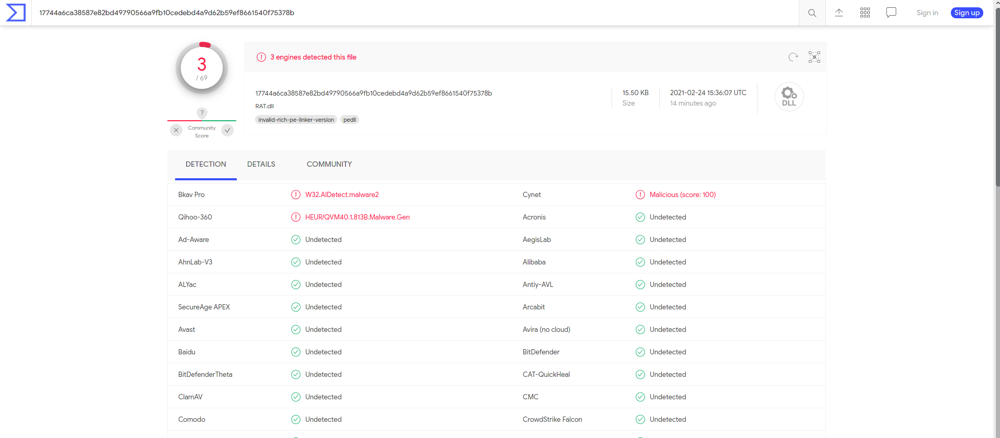

# simple-RAT-tool v1.3
A very simple tool for remote administration of your computer, implemented using dll and sockets.

### Start Server:
```cpp
#include "server.h"

int main()
{
	Server input("127.0.0.1", 4444); //ip:port
  
  	return 0;
}
```
### Setting up the entry point and building the Dll:
```cpp
#include "client_sock.h"

#define EXPORT _declspec(dllexport)

extern "C" EXPORT void client()
{
	Client* start = new Client("127.0.0.1", 4444);
	CreateThread(0, 0, LPTHREAD_START_ROUTINE(start->connect_client()), 0, 0, 0);
}
```
# Dll startup:
The dll can be launched in several ways:
### 1)Launch with rundll32.exe (during tests, the launch took place):
rundll32.exe name.dll, dll entry point

### 2)You can export dll from your program and run it there:
#### This is how it will look on assembler(FASM):
Note: the program must be in the same directory with the dll!

```asm
format PE console

include 'win32a.inc'

       entry DllEntrypoint

section '.data' data readable writable

        result db 'Dll has been started!', 0


section '.text' code readable executable

        DllEntrypoint:
                push result
                call [printf]
                invoke client      ; <- Calling the entry point from the import table, where we specified the name and entry point of the dll.
		

section '.idata' import data readable

        library msvcrt, 'msvcrt.dll', \ 
                RAT, 'RAT.dll'     ; <- Import table from where we import dll.

        import RAT,\
               client, 'client'   ; <- Entry point name.

        import msvcrt,\
               printf, 'printf'
```
# Virus total check:

  
